<p align="center">
  
</p>

<h1 align="center">viberuler</h1>
<p align="center"><b>The benchmark for vibe coders.</b><br>How hard do you actually vibe? There's only one way to find out:</p>

```bash
npx viberuler
```

<p align="center">
  <a href="https://www.npmjs.com/package/viberuler"></a>
  <a href="https://github.com/master5d/viberuler/actions"></a>
  
  
</p>

---

## What it does

`viberuler` scans your machine — locally, in seconds — and computes your **VIBE SCORE**:

| Signal | Source | Flex |
|---|---|---|
| 🧠 tokens burned | Claude Code + Codex session logs (+ your LiteLLM gateway, opt-in) | `1.2B tokens` |
| 💸 **tokens per dollar** | tokens ÷ spend (bundled price table) | `6.5M tok/$ — TOP 3%` |
| ⚡ LoC shipped | `git ls-files` across your repos | `312K LoC` |
| 📦 projects | repos where *you* authored commits | `47 projects` |
| 🔥 streak | consecutive commit days | `212-day streak` |
| 🏆 achievements | see below | `Token Billionaire` |
| 🤖 agents in the stable | marker dirs of known coding agents in your home | `5 agents · Claude Code · Codex · Cursor` |

Then it prints a scorecard you'll screenshot before you can stop yourself.

**`tokens per dollar` is the headline stat.** Anyone can burn tokens. Burning them *efficiently* is the game.

<p align="center">
  
</p>

## The ranks

`Prompt Peasant` → `Vibe Apprentice` → `Token Burner` → `Context Goblin` → `Ship Machine` → `GIGACHAD SHIPPER` → `Singularity Adjacent`

(No data? You get `NPC (no vibes detected)`. We're sorry. We're not sorry.)

## Achievements

| | | |
|---|---|---|
| 💰 **Token Billionaire** — ≥1B tokens | 🪦 **Free Tier Martyr** — ≥1M tokens under $1 | 🗄️ **Cache Whisperer** — >90% cache reads |
| 🌐 **Polyglot** — 5+ languages | 🐘 **Monorepo Menace** — a 100K+ LoC repo | 🔥 **Streak Freak** — 100-day streak |
| 🌙 **3AM Committer** — 10+ night commits | 💥 **YOLO Force Pusher** — 20+ history rewrites | |

## The leaderboard

```bash
npx viberuler --submit
```

GitHub device-flow login → your score goes live at `viberuler.dev/u/<you>` with an OG card built for flexing. Global rank. Efficiency percentile. Prefilled share links.

## Privacy (read this, HN)

- The default run makes **zero network calls**. Zero.
- `--submit` sends **aggregates only** — nine fields of aggregate stats and achievement ids. No paths, no repo names, no prompts, no code. Ever.
- Before anything is sent, the CLI prints the **exact JSON payload** and asks.
- Don't trust us — read the ~140 lines: [`packages/cli/src/payload.ts`](packages/cli/src/payload.ts) and [`packages/cli/src/submit.ts`](packages/cli/src/submit.ts). Details: [PRIVACY.md](PRIVACY.md).

## The math

Full formula, price table, normalization and honest disclaimers in [METHODOLOGY.md](METHODOLOGY.md). Short version:

```
VIBE = 1000·log₁₀(1 + LoC/1000)          # shipping volume
     +  500·log₁₀(1 + tokens/1M)         # AI leverage
     +  800·efficiency_percentile        # tokens/$ vs the world
     +  300·log₁₀(1 + projects·10)       # breadth
     +  min(streak, 365) + 50·achievements
```

Logarithms everywhere — whales get compressed, newcomers have room to climb.

## Flags

```
npx viberuler                # scan + scorecard (100% local)
npx viberuler --submit       # push to the global leaderboard
npx viberuler payload        # show exactly what --submit WOULD send
npx viberuler --json         # machine-readable
npx viberuler --scan-dir ~/code --since 2026-01-01
npx viberuler --github <handle>   # add your stars (the only other network call)
```

## Statusline

Put your score where your ego lives — ready-to-paste snippets for **Claude Code**, **Starship**, **oh-my-posh**, **tmux**, and raw shell prompts in [`integrations/statusline/`](integrations/statusline/). One cache file, sub-millisecond reads:

```
Fable 5 · ⚡3982 Context Goblin · 481.5K tok/$
```

## Roadmap — PRs welcome

- [x] Claude Code collector (tokens, cost, cache-hit dedup)
- [x] Codex collector
- [ ] Cursor collector — `good first issue`
- [ ] Gemini CLI collector — `good first issue`
- [ ] Windsurf / Aider / Cline collectors — `good first issue`
- [ ] Team leaderboards

A collector is one file implementing a 2-method interface: [`packages/cli/src/types.ts`](packages/cli/src/types.ts).

## Stack

TypeScript CLI (one runtime dep: `picocolors`). Backend: Cloudflare Worker + D1, OG images rendered in-worker by satori — [`packages/worker`](packages/worker). Font: JetBrains Mono (OFL). MIT.

---

<p align="center"><i>Your prompts never leave your machine. Your score never leaves the group chat.</i></p>
